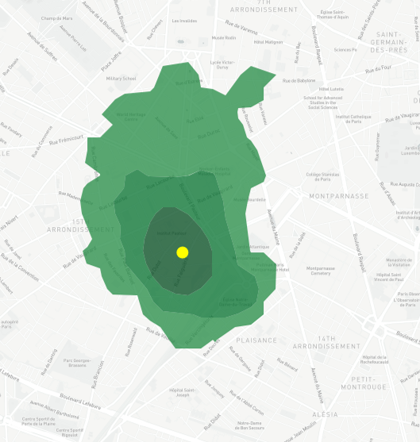
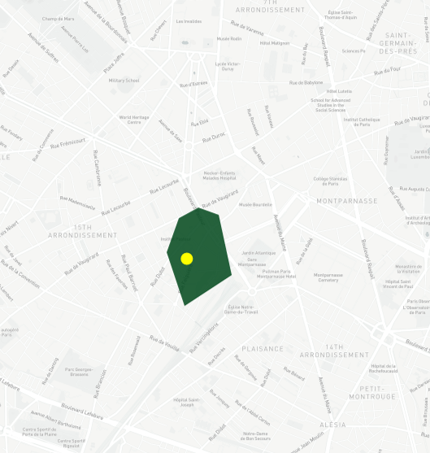
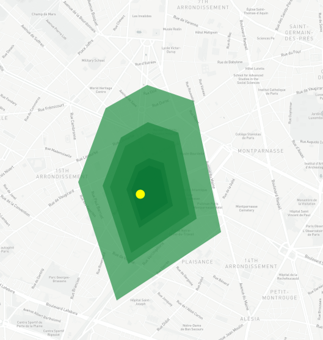
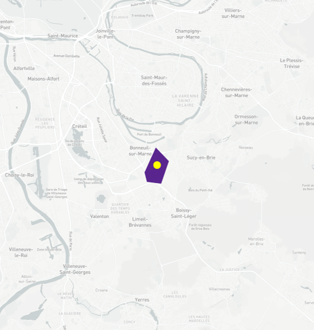
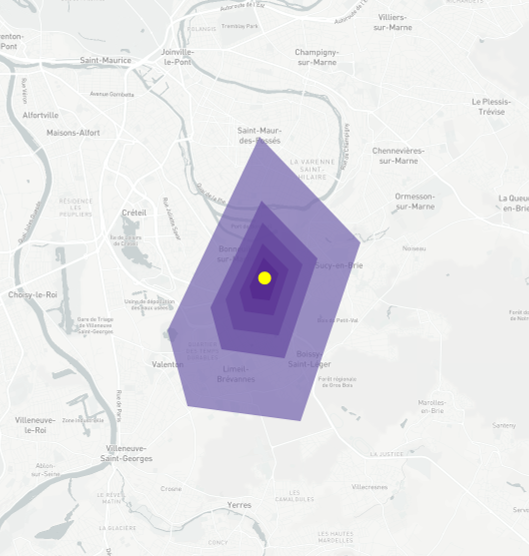
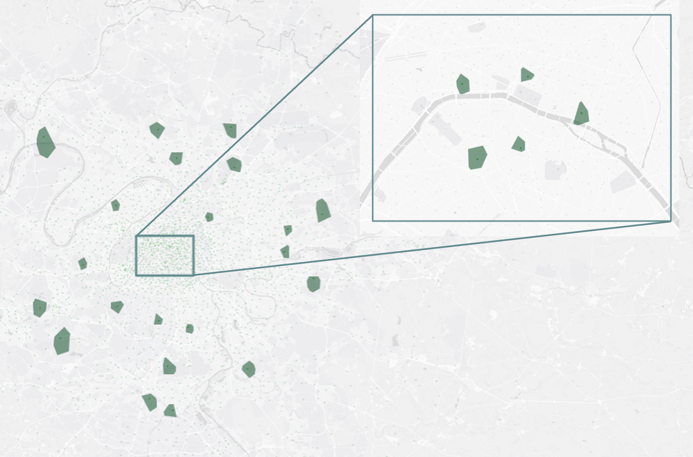
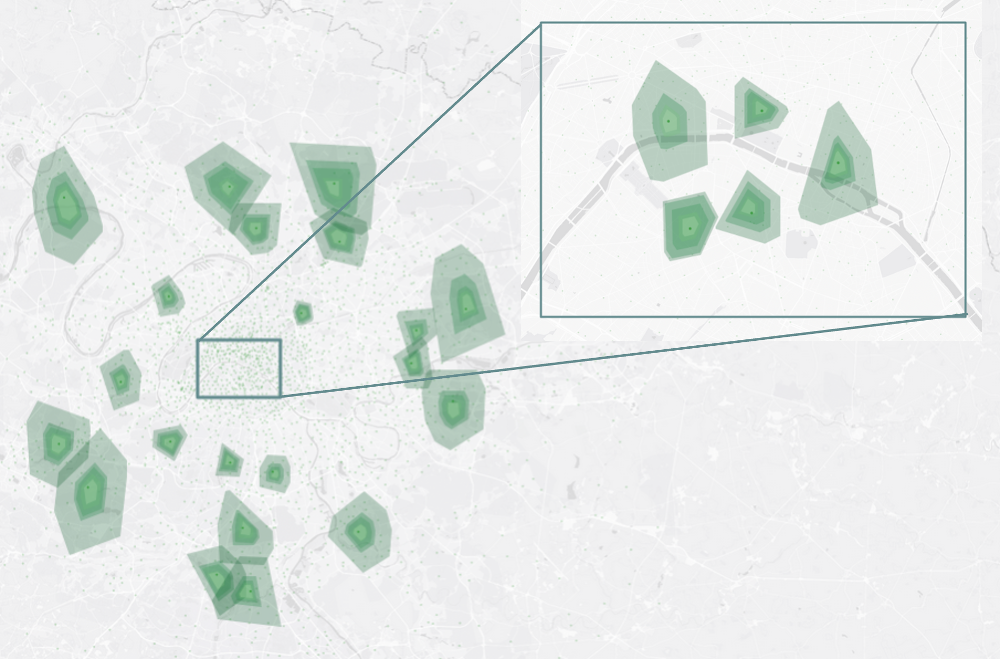

# VoronoiBoost

*VoronoiBoost*, is a data-driven model that scales Voronoi cells to match the probabilistic distribution of
users associated to each base station. 
*VoronoiBoost* relies on the same input as traditional Voronoi decompositions, but provides a richer and more accurate rendering of where users are located.

For more details, please refer to our paper '[VoronoiBoost: Data-driven Probabilistic Spatial Mapping of Mobile Network Metadata](https://ieeexplore.ieee.org/document/9918610)' published in IEEE Communications Society Conference on Sensor and Ad Hoc Communications and Networks (SECON) 2022 Conference proceeding.

Also, We present a large-scale data set of wireless network coverage for over 22,000 4G base stations in France. The data covers ten main metropolitan areas in the country, encompassing a variety of dense urban, suburban and rural areas. The coverage information in each area is reported separately for the four major mobile network operators active in France.
For each base station in the data set, coverage is represented as a set of polygonal shapefiles, each associated with a given probability that end terminals associated to the base station are located within the polygon.
The data set substantially improves current practices for cellular coverage representation in large-scale studies, which primarily rely on plain Voronoi tessellations of the geographical space.
As such, the data set can support data-driven networking research where coverage overlap or interference are key factors, as well as multidisciplinary investigations based on network metadata that needs to be mapped on the territory.
**The dataset is available in the [coverage](https://github.com/nds-group/voronoiBoost/tree/main/coverage) folder.**


| Ground Truth                             | Voronoi                                    | VoronoiBoost                             |
| ---------------------------------------- | ------------------------------------------ | ---------------------------------------- |
|   |   |   |
|  |  |  |

## Installation

Clone this repository and install the requirements:

```bash
git clone https://github.com/nds-group/voronoiBoost.git

pip install -r requirements.txt
```

## Usage
First is need to import the VoronoiBoost class from the voronoiBoost.py file:

```python
import pandas as pd

from shapely.geometry import shape as Shape
from shapely.geometry import Polygon

from voronoiBoost import VoronoiBoost
```

**VoronoiBoost** use the same input as a standard voronoi tesselation, 
* set of points (base stations) 
* a border area that defines the area of interest

then, and instance can be lunch by provinding also the path to the trained model file.

```python
voronoiBoost = VoronoiBoost(sites, city_shape, model_path)

df_bs = voronoiBoost.compute_voronoiBoost()
df_bs.head(2)
```

The output is a pandas dataframe with the following columns:
``lon``, ``lat``, ``voronoi`` & ``voronois_scaled_overlap``

where ``voronoi`` is the voronoi cell associated to the base station and ``voronois_scaled_overlap`` is the scaled voronoi cell.

The following images show the legacy voronoi decomposition and the voronoiBoost decomposition for the same base stations. Other base stations are hidden for clarity.

| Legacy tessallation | VoronoiBoost |
| ------------------- | ------------ |
|   |  