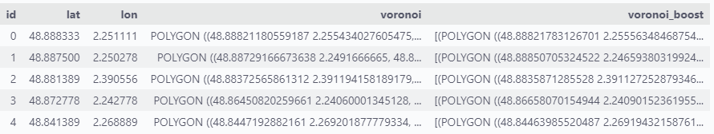
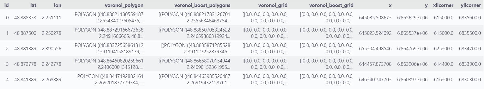

# VoronoiBoost & Wireless Network Coverage in the Wild

## VoronoiBoost

It is a data-driven model that scales Voronoi cells to match the probabilistic distribution of
users associated to each base station (coverage).
*VoronoiBoost* relies on the same input as traditional Voronoi decompositions, but provides a richer and more accurate rendering of where users are located.
For more details, please refer to our paper '[VoronoiBoost: Data-driven Probabilistic Spatial Mapping of Mobile Network Metadata](https://ieeexplore.ieee.org/document/9918610)' published in IEEE Communications Society Conference on Sensor and Ad Hoc Communications and Networks (SECON) 2022 Conference proceeding.

| Operator coverage                             | Voronoi                                    | VoronoiBoost                             |
| ---------------------------------------- | ------------------------------------------ | ---------------------------------------- |
|  |  |  |
<!-- |   |   |   | -->
The image show the operator coverage for a single base station (left), the traditional Voronoi decomposition (center), and the VoronoiBoost model (right).


### Installation and Usage

Clone this repository and install the requirements:

```bash
git clone https://github.com/nds-group/voronoiBoost.git
pip install -r requirements.txt
```

First is need to import the VoronoiBoost class from the voronoiBoost.py file:

```python
from voronoiBoost import VoronoiBoost
```

VoronoiBoost use the same input as a standard voronoi tesselation, 
* set of points, i.e: base stations locations
* boundary of the area of interest, i.e: City or Country boundaries

then, and instance can be lunch by provinding also the path to the trained Gradient Boost Regressor [model](https://github.com/nds-group/voronoiBoost/tree/main/model).

```python
voronoiBoost = VoronoiBoost(sites, city_shape, model_path)

df_bs = voronoiBoost.compute_voronoiBoost()
df_bs.head(5)
```

The output is a pandas dataframe with the following columns:
``lon``, ``lat``, ``voronoi`` (the legacy voronoi cell associated) & ``voronoi_boost`` (the scaled voronoi cells for different probabilities).



A full working example can be found in the [VoronoiBoost_Example.ipynb](https://github.com/nds-group/voronoiBoost/blob/main/VoronoiBoost_Example.ipynb) file.


## Wireless Network Coverage in the Wild: A Multi-City Multi-Operator Data Set

It is a large-scale [data set](https://github.com/nds-group/voronoiBoost/tree/main/coverage) of wireless network coverage for over 22,000 4G base stations in France. This data set is generated by applying *VoronoiBoost* and official sources of base station deployment. The data covers ten main metropolitan areas in the country, encompassing a variety of dense urban, suburban and rural areas. The coverage information in each area is reported separately for the four major mobile network operators active in France.

The data set substantially improves current practices for cellular coverage representation in large-scale studies, which primarily rely on plain Voronoi tessellations of the geographical space.
As such, the data set can support data-driven networking research where coverage overlap or interference are key factors, as well as multidisciplinary investigations based on network metadata that needs to be mapped on the territory.
The following images show the legacy voronoi decomposition and the voronoiBoost decomposition for the same base stations. Other base stations are hidden for clarity.

| Voronoi | VoronoiBoost |
| ------------------- | ------------ |
|   |  

For each base station in the data set, coverage is represented as a set of polygonal shapefiles, each associated with a given probability that end terminals associated to the base station are located within the polygon.



The dataset is a collection of 40 (zip compress) pickle files encompassing four operators :

* Bouygues
* Free 
* Orange
* SFR
 
and 10 French cities:

* Bordeaux 
* Lille 
* Lyon 
* Le Mans
* Nantes 
* Nice 
* Orleans 
* Paris
* Rennes 
* Toulouse 

The pandas dataframe structure is the following: 

* lon: Base station longitude in [WGS84](https://epsg.io/4326)
* lat: Base station latitude in [WG84](https://epsg.io/4326)
* voronoi_polygon: shapely polygon of the legacy tessellation
* voronoi_boost_polygons: list of optimal scaled Voronoi polygon for different probabilities of association.
* voronoi_grid: the 100m x 100 m discrete representation in a 2d matrix
* voronoi_boost_grid: the 100m x 100 m discrete representation in a 2d matrix
* x: x component of the BS coordinates in the [Lambert93](https://epsg.io/2154) metric system
* y: y component of the BS coordinate in the [Lambert93](https://epsg.io/2154) metric system. 
* xllcorner: x component of the lower left coordinates of the metric grids in Lambert93 (voronoi_grid/voronoi_boost_grid)
* yllcorner: y component of the lower left coordinates of the metric grids in Lambert 93 (voronoi_grid/voronoi_boost_grid)


The data set is available in the [coverage](https://github.com/nds-group/voronoiBoost/tree/main/coverage) folder.
The notebook [Coverage_in_the_Wild.ipynb](https://github.com/nds-group/voronoiBoost/blob/main/Coverage_in_the_Wild.ipynb) shows how to interact with the data set.